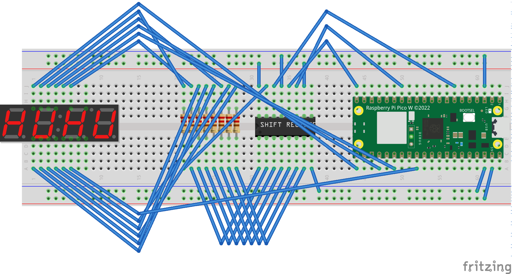

# Seven-Segment


## COM-11405 ピン配置

| 12  | 11  | 10  | 9   | 8   | 7   |
| --- | --- | --- | --- | --- | --- |
| c1  | a   | f   | c2  | c3  | b   |

| 1   | 2   | 3   | 4   | 5   | 6   |
| --- | --- | --- | --- | --- | --- |
| e   | d   | dp  | c   | g   | c4  |

## 使い方 0: 配線

- COM ピン (c1〜c4) → Pico の GPIO へ接続（例：16, 18, 20, 22）
- セグメント a〜g, dp → シフトレジスタ（例：74HC595）を介して Pico に接続
- シフトレジスタの latch, clock, data も適切な GPIO に接続



## 使い方 1: Wi-Fi の設定

- 設定ファイルをコピー：

```sh
cp src/wifi_config.py.example src/wifi_config.py
```

- `src/wifi_config.py` に Wi-Fi 情報を記載：

```python
SSID = "YOUR_SSID"
PASSWORD = "YOUR_PASSWORD"
```

## 使い方 2: Pico の初期化

- Pico W を **BOOTSEL モード**で接続
- 以下から MicroPython 用 `.uf2` ファイルをダウンロード：  
  https://micropython.org/download/rp2-pico-w/rp2-pico-w-latest.uf2
- マウントされた Pico ドライブに `.uf2` をドラッグ＆ドロップで書き込み

## 使い方 3: VSCode + MicroPico 開発環境の準備

### 必要なもの

- Python 3.10 以上
- Visual Studio Code (VSCode)
- MicroPico 拡張機能

### セットアップ手順

1. VSCode を開き、MicroPico 拡張機能をインストール
2. Pico W を USB 接続
3. VSCode の**下部ステータスバー**から接続
4. `src` フォルダ内（特に `main.py`）を「アップロード」ボタンで転送

## 使い方 4: 起動と停止

- VSCode のステータスバーまたは MicroPico インターフェースの ▶ 実行ボタンで実行
- 実行中の出力は REPL に表示される
- 停止するには `Ctrl+C`（macOS では `Cmd+C`）を押す
